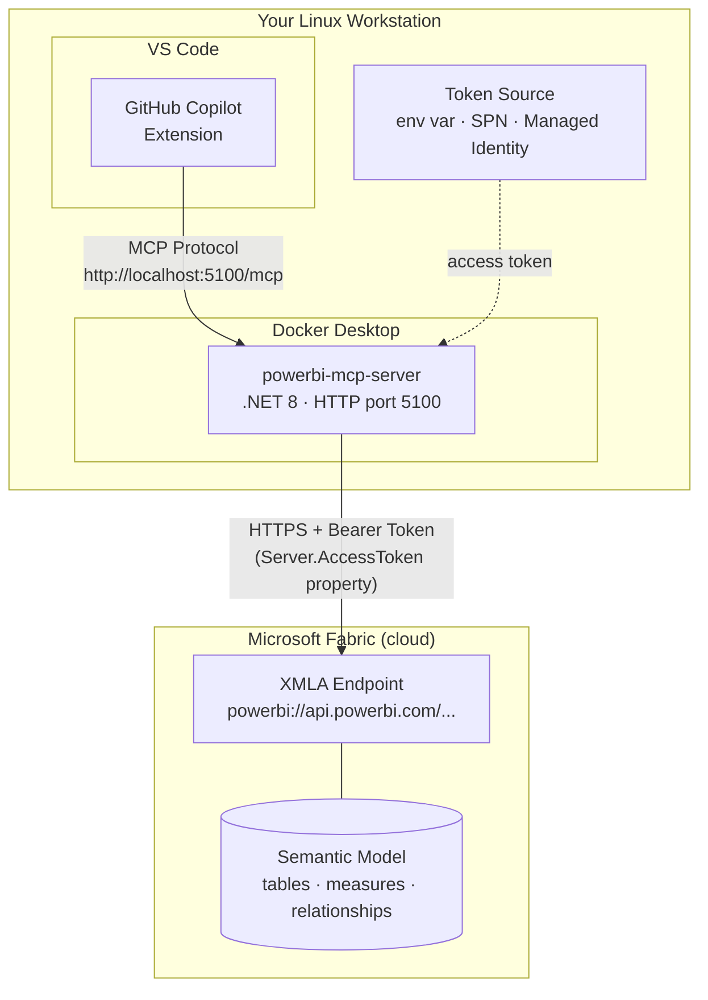

# Power BI Modeling MCP Server — Docker Deployment Guide

This document covers how to build, deploy, authenticate, and verify the Power BI Modeling MCP Server running in a Docker container connecting to Microsoft Fabric workspaces.

---

## Table of Contents

1. [Architecture Overview](#1-architecture-overview)
2. [Prerequisites](#2-prerequisites)
3. [Build the Docker Image](#3-build-the-docker-image)
4. [Authentication](#4-authentication)
5. [Run the Container](#5-run-the-container)
6. [Configure Your MCP Client](#6-configure-your-mcp-client)
7. [Verify the Deployment](#7-verify-the-deployment)
8. [Usage Examples](#8-usage-examples)
9. [What Was Changed (and Why)](#9-what-was-changed-and-why)
10. [Troubleshooting](#10-troubleshooting)

---

## 1. Architecture Overview



**How it works:**

1. **GitHub Copilot** (running in VS Code on your machine) connects to the MCP server via HTTP on `localhost:5100/mcp`
2. The **MCP server** runs inside a Docker container on your local machine — it exposes Power BI modeling tools (tables, measures, DAX, etc.) via the MCP protocol
3. When Copilot invokes `connection_connect_fabric`, the server authenticates to Fabric's **XMLA endpoint** using a bearer token set via the `Server.AccessToken` property
4. The token is sourced from either the `PBI_MODELING_MCP_ACCESS_TOKEN` environment variable or `DefaultAzureCredential` (service principal, managed identity, etc.)

> Everything runs locally on your Linux machine except the Fabric workspace itself, which is in the cloud.

---

## 2. Prerequisites

### Local Machine

- [Docker Engine](https://docs.docker.com/engine/install/) (or [Docker Desktop for Linux](https://docs.docker.com/desktop/setup/install/linux/))

### Microsoft Fabric / Power BI Tenant

These settings **must** be enabled before the XMLA endpoint will accept connections:

| Requirement | Where to configure |
|---|---|
| **XMLA endpoint enabled** | Admin Portal → Tenant settings → Integration → "Allow XMLA endpoints and Analyze in Excel" → **Enabled** |
| **XMLA endpoint set to Read Write** | Admin Portal → Capacity settings → select your capacity → Power BI Workloads → XMLA Endpoint → **Read Write** |
| **Workspace on Premium/Fabric capacity** | Shared/Pro capacity has **no XMLA endpoint** — requires **P1+**, **PPU**, **F2+**, or **A1+** |
| **Service principal allowed** (if using SPN) | Admin Portal → Tenant settings → Developer settings → "Allow service principals to use Power BI APIs" → **Enabled** |
| **Service principal is workspace member** (if using SPN) | Workspace → Manage access → Add the service principal as **Member** or **Admin** |

> **Cross-tenant (B2B/guest) users**: replace `myorg` with the tenant domain in the XMLA URL:
> `powerbi://api.powerbi.com/v1.0/fabrikam.com/WorkspaceName`

---

## 3. Build the Docker Image

From the repository root:

```bash
docker build -t powerbi-mcp-server .
```

This uses the multi-stage [Dockerfile](Dockerfile):
- **Build stage**: .NET 8 SDK, restores packages, publishes a Release build
- **Runtime stage**: .NET 8 ASP.NET runtime (Debian), installs `libicu72`, `libssl3`, `ca-certificates` for ADOMD/TLS connectivity

The image runs the server in **HTTP transport** mode on port **5100** by default.

---

## 4. Authentication

The server needs a valid Azure AD / Entra ID token with scope `https://analysis.windows.net/powerbi/api/.default` to connect to Fabric XMLA endpoints. Three options are available:

### Option A: Pre-fetched Access Token (development / testing)

Requires [Azure CLI](https://learn.microsoft.com/cli/azure/install-azure-cli) (`az`). Acquire a token and pass it as an environment variable:

```bash
TOKEN=$(az account get-access-token --resource "https://analysis.windows.net/powerbi/api" --query accessToken -o tsv)
docker run -p 5100:5100 -e PBI_MODELING_MCP_ACCESS_TOKEN="$TOKEN" powerbi-mcp-server
```

> Tokens expire in ~60–90 minutes. Re-run the `az account get-access-token` command and restart the container when the token expires.

### Option B: Service Principal (production / CI/CD)

Pass Entra ID service principal credentials as environment variables. `DefaultAzureCredential` inside the container picks up `EnvironmentCredential` automatically:

```bash
docker run -p 5100:5100 \
  -e AZURE_TENANT_ID="<your-tenant-id>" \
  -e AZURE_CLIENT_ID="<your-client-id>" \
  -e AZURE_CLIENT_SECRET="<your-client-secret>" \
  powerbi-mcp-server
```

**Service principal setup requirements:**
1. Create an App Registration in Entra ID
2. Create a client secret under Certificates & secrets
3. Grant API permission: **Power BI Service → Dataset.ReadWrite.All** (admin-consent required)
4. In Fabric Admin Portal: enable "Allow service principals to use Power BI APIs"
5. Add the service principal as a **Member** or **Admin** of the target workspace

With this option, the token is acquired automatically on each `connection_connect_fabric` call — no manual token refresh needed.

### Option C: Azure Managed Identity (Azure-hosted containers)

When running on Azure Container Instances (ACI), Azure Container Apps (ACA), or AKS:

```bash
# Example: assign system-managed identity to a Container App
az containerapp identity assign -n my-app -g my-rg --system-assigned
```

No environment variables needed. `DefaultAzureCredential` auto-detects the managed identity. The managed identity must be added as workspace member with appropriate permissions.

### Authentication Priority

When `connection_connect_fabric` is called, the server resolves the token in this order:

1. **`PBI_MODELING_MCP_ACCESS_TOKEN` env var** — used directly if set
2. **`DefaultAzureCredential`** — tries (in order): environment variables (SPN), managed identity, Azure CLI, and other Azure SDK credential sources

---

## 5. Run the Container

### Basic run (with pre-fetched token)

```bash
TOKEN=$(az account get-access-token --resource "https://analysis.windows.net/powerbi/api" --query accessToken -o tsv)

docker run -d --name powerbi-mcp -p 5100:5100 \
  -e PBI_MODELING_MCP_ACCESS_TOKEN="$TOKEN" \
  powerbi-mcp-server
```

### Run with service principal

```bash
docker run -d --name powerbi-mcp -p 5100:5100 \
  -e AZURE_TENANT_ID="00000000-0000-0000-0000-000000000000" \
  -e AZURE_CLIENT_ID="11111111-1111-1111-1111-111111111111" \
  -e AZURE_CLIENT_SECRET="your-client-secret-value" \
  powerbi-mcp-server
```

### Run in read-only mode

Append `--readonly` to prevent any write operations:

```bash
docker run -d --name powerbi-mcp -p 5100:5100 \
  -e PBI_MODELING_MCP_ACCESS_TOKEN="$TOKEN" \
  powerbi-mcp-server \
  dotnet powerbi-mcp-server.dll --transport http --host 0.0.0.0 --port 5100 --readonly
```

### CLI flags reference

| Flag | Default | Description |
|---|---|---|
| `--transport` | `http` | `stdio` or `http` |
| `--host` | `0.0.0.0` | Bind address |
| `--port` | `5100` | Listen port |
| `--readonly` | off | Block all write operations |
| `--skipconfirmation` | off | Skip write confirmations |
| `--compatibility` | `PowerBI` | Use `Full` for Analysis Services |

---

## 6. Configure Your MCP Client

### VS Code / GitHub Copilot (`.vscode/mcp.json`)

Create or update `.vscode/mcp.json` in your project:

```jsonc
{
  "servers": {
    "powerbi-mcp-server": {
      "type": "sse",
      "url": "http://localhost:5100/mcp"
    }
  }
}
```

### Endpoints

| Endpoint | Description |
|---|---|
| `http://localhost:5100/mcp` | MCP Streamable-HTTP endpoint (stateful sessions) |
| `http://localhost:5100/healthz` | Health check — returns JSON with status, version, connection count |

---

## 7. Verify the Deployment

### Step 1: Check the container is running

```bash
docker ps --filter name=powerbi-mcp
```

### Step 2: Hit the health endpoint

```bash
curl http://localhost:5100/healthz
```

Expected response:
```json
{"status":"healthy","transport":"http","version":"1.0.0","connections":0}
```

### Step 3: Test a Fabric connection

Using any MCP client, call `connection_connect_fabric`:

```
Tool: connection_connect_fabric
Parameters:
  workspaceName: "My Workspace"
  semanticModelName: "My Semantic Model"
```

Expected response:
```
Connected to **My Semantic Model** in workspace **My Workspace** (connection `a1b2c3d4e5f6`).
```

### Step 4: Run a DAX query

```
Tool: dax_query
Parameters:
  connectionId: "a1b2c3d4e5f6"
  query: "EVALUATE ROW(\"Test\", 1)"
```

---

## 8. Usage Examples

### List all tables in a model

```
1. connection_connect_fabric(workspaceName="Sales", semanticModelName="Sales Model")
   → returns connectionId "abc123"

2. table_list(connectionId="abc123")
   → returns markdown table of all tables with row counts
```

### Create a measure

```
1. measure_create(
     connectionId="abc123",
     tableName="Sales",
     measureName="Total Revenue",
     expression="SUM(Sales[Amount])",
     formatString="$#,##0.00"
   )
```

### Export model as TMDL

```
1. tmdl_export(connectionId="abc123", outputPath="/tmp/model-export")
```

### Disconnect when done

```
1. connection_disconnect(connectionId="abc123")
```

---

## 9. What Was Changed (and Why)

### The Problem

When running inside a Docker container (Linux), `connection_connect_fabric` returned:

```
Authentication failed for all authenticators
CreateSession → 401
```

Even when a valid token was acquired successfully via `PBI_MODELING_MCP_ACCESS_TOKEN` or `DefaultAzureCredential`.

### Root Cause

The original code embedded the token in the connection string via `Password=`:

```csharp
// BEFORE — broken on Linux
connectionString = $"Data Source={xmlaEndpoint};Initial Catalog={safeCatalog};Password={token};";
```

When `Password=` is used, ADOMD.NET tries its **internal MSAL authenticator chain first** (browser redirect, Windows Integrated/SSPI, ADAL cache, etc.) before falling back to treating the value as a raw bearer token. On Linux containers, **every one of these internal authenticators fails**, resulting in the 401 error.

Microsoft's documentation explicitly states:
> *"Using the Password connection string property to pass an access token is discouraged. Use the AccessToken property instead."*

### The Fix

Three files were modified:

| File | Change |
|---|---|
| [Models/ConnectionInfo.cs](src/PowerBiMcpServer/Models/ConnectionInfo.cs) | Added `AccessToken` property to carry the token separately from the connection string |
| [Services/ConnectionManager.cs](src/PowerBiMcpServer/Services/ConnectionManager.cs) | Uses `Server.AccessToken` and `AdomdConnection.AccessToken` properties (type `Microsoft.AnalysisServices.AccessToken`) instead of `Password=` — bypasses MSAL entirely |
| [Tools/ConnectionTools.cs](src/PowerBiMcpServer/Tools/ConnectionTools.cs) | Removed `Password=` from connection string; passes token via `accessToken` parameter; improved error messages |

**Before vs After:**

| Before (broken on Linux) | After (works everywhere) |
|---|---|
| Token in `Password=` field | Token via `Server.AccessToken` / `AdomdConnection.AccessToken` property |
| ADOMD tries MSAL chain → all fail on Linux | `AccessToken` property **bypasses MSAL entirely** |
| Generic error message | Lists all 3 auth options with details |

---

## 10. Troubleshooting

### "Authentication failed for all authenticators"

- **Cause**: Token not being passed, or using an old build that still uses `Password=`
- **Fix**: Rebuild the Docker image with the latest code; verify `PBI_MODELING_MCP_ACCESS_TOKEN` or SPN env vars are set

### "XMLA endpoint not found" or connection timeout

- **Cause**: XMLA endpoint not enabled or workspace not on Premium/Fabric capacity
- **Fix**: Check the [Prerequisites](#2-prerequisites) table — all four settings must be configured

### Token expired (after ~60–90 min with Option A)

- **Cause**: Pre-fetched tokens have a limited lifetime
- **Fix**: Re-acquire the token and restart the container, or switch to service principal auth (Option B) for automatic renewal

### "No such host" or DNS errors

- **Cause**: Container can't resolve `api.powerbi.com`
- **Fix**: Ensure Docker networking allows outbound HTTPS. Test with:
  ```bash
  docker exec powerbi-mcp curl -s https://api.powerbi.com
  ```

### Service principal 403 / Unauthorized

- **Cause**: SPN missing permissions or not added to workspace
- **Fix**: Verify all 5 steps in [Option B](#option-b-service-principal-production--cicd) under [Authentication](#4-authentication) are completed

### Container starts but health check fails

- **Cause**: Port mapping or bind address issue
- **Fix**: Verify port mapping (`-p 5100:5100`) and that no other process is using port 5100:
  ```bash
  docker logs powerbi-mcp
  ```

---

## Quick Reference

```bash
# Build
docker build -t powerbi-mcp-server .

# Run (dev — pre-fetched token)
TOKEN=$(az account get-access-token --resource "https://analysis.windows.net/powerbi/api" --query accessToken -o tsv)
docker run -d --name powerbi-mcp -p 5100:5100 -e PBI_MODELING_MCP_ACCESS_TOKEN="$TOKEN" powerbi-mcp-server

# Run (prod — service principal)
docker run -d --name powerbi-mcp -p 5100:5100 \
  -e AZURE_TENANT_ID="..." -e AZURE_CLIENT_ID="..." -e AZURE_CLIENT_SECRET="..." \
  powerbi-mcp-server

# Health check
curl http://localhost:5100/healthz

# View logs
docker logs -f powerbi-mcp

# Stop
docker stop powerbi-mcp && docker rm powerbi-mcp
```
